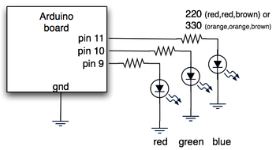
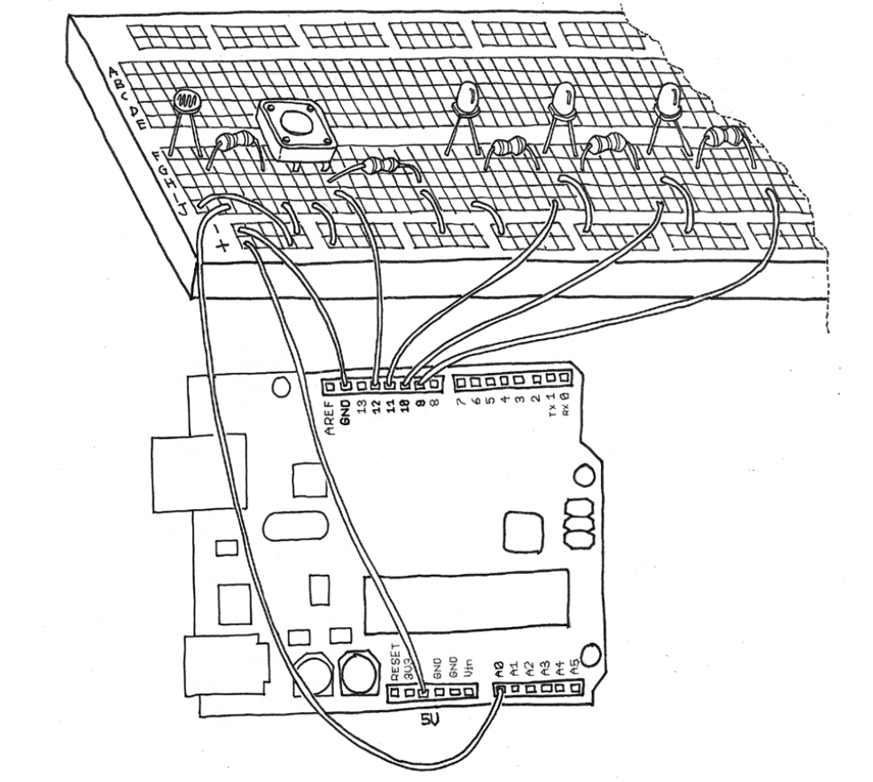

# Example_08 From "Getting Started with Arduino, Second Edition"

Updated and fixed ***Example 08A*** processing sketch from this book. 
I did ***NOT*** touch the arduino code as of yet. I may eventually fully 
test both pieces to ensure they work together, or update them otherwise.

I hope this helps others out there who wanted to fully complete this project like I did.

---

# Schematics

I have located and included the original schematic for reference:

A well as the one from the book:

# Links

Here are links to the original sources of information:

- [Archive.org Getting Started Arduino Second Edition](https://dn790006.ca.archive.org/0/items/MassimoBanziGettingStartedWithArduinoMake2011/Massimo%20Banzi-Getting%20Started%20with%20Arduino%20-Make%20%282011%29.pdf)
- [Original blog post](https://todbot.com/blog/2006/10/23/diy-ambient-orb-with-arduino-update/)
