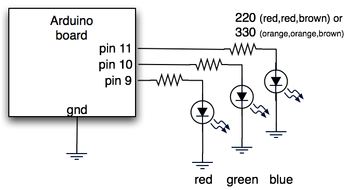
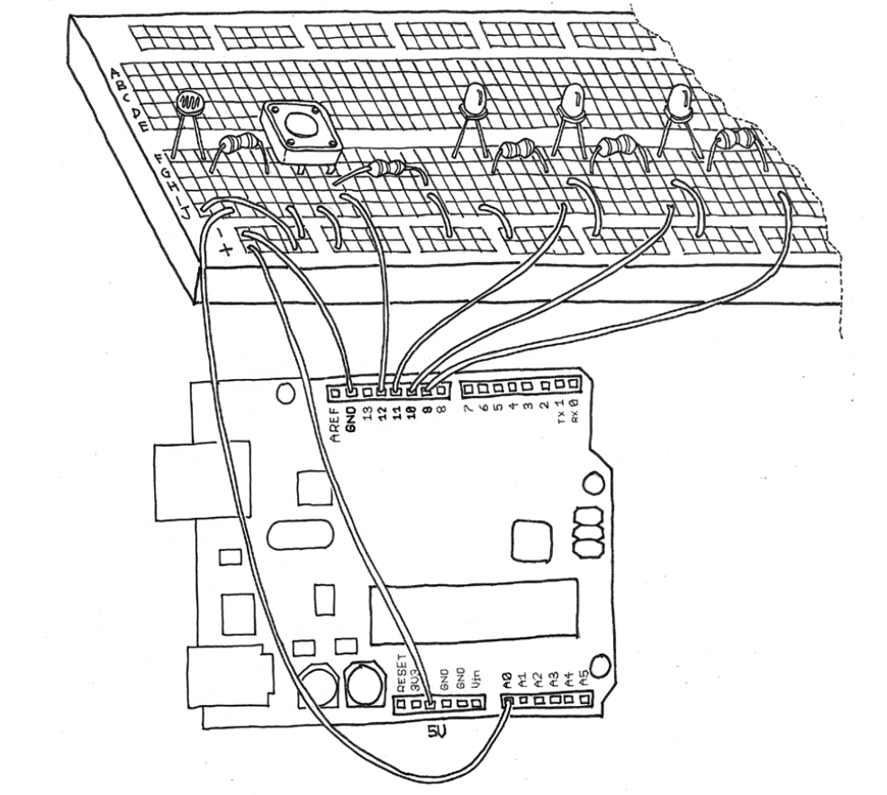
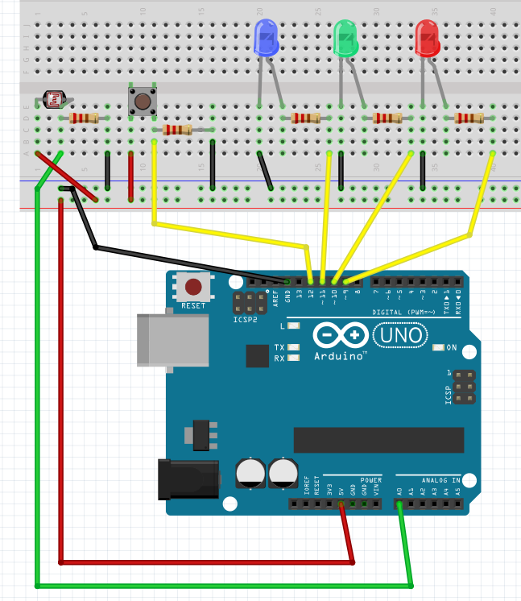
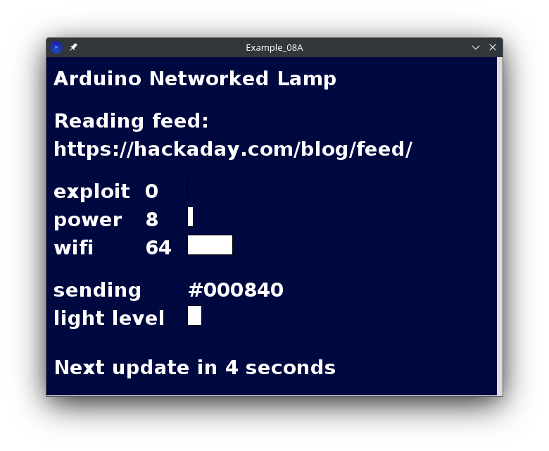

# Example 08 From "Getting Started with Arduino, Second Edition"

Updated and fixed ***Example 08A*** processing sketch from this book. 
The arduino code needed slight tweaking as well but I have now fully 
tested both pieces to ensure they work together.

## What is this exactly?

This project originally sets up a lamp that will change colors based on information pulled from an xml or RSS feed. 

This book version includes a light sensor and a button to start the process as well as the 3 LEDs for red, green, and blue.

This project and original code are over a decade old, and others have had the same issues I did. This led me to create this repository.

## Further
Another idea is to set up the code to work with the original schematic as well, using commented out alternative sections of code.

I hope this helps others out there who wanted to fully complete this project like I did.

---

# Schematics

I have located and included the original schematic for reference:



A well as the one from the book that goes with the above code:



I decided to make my own schematic because the one from the book is a little hard to see in places:



---

# Usage

## Things to note

***Important:*** In the processing sketch on line 49 you might have to change the number in
```String arduinoPort = Serial.list()[1];``` to match your port. Most likely ```0``` if not ```1```. You can also 
uncomment line 48 and run the sketch to print a list of available ports.

I have included a pre-made font file in the source folder, but feel free to create your own.
You can create the font file in the Processing IDE:

- Copy the font name from the sketch
- Under the "tools" menu click the font tool
- Match a font to the right size and paste the name from the sketch
- Click create

## Running

Once you have tweaked the source files to your desired settings 
and finished wiring up the circuit:

- Connect the arduino
- Upload the ```Example_08B.ino``` sketch to your arduino
- Close the arduino IDE to free your serial port
- Run the ```Example_08A.pde``` sketch in processing
- Press the circuit's button to toggle the leds on and off

You should see a screen like this:



Congratulations! You have built an internet connected lamp that will change depending on 
whatever parameters you specified.

# Final Words

This project is very extensible, and I hope someone gets some use from it. I'm personally 
thinking I might set this up to monitor HF band conditions for listening to shortwave radio, 
but the possibilities are endless.

Another thing that I find very nice about the Processing IDE is the ability to export your 
program with a self contained java/processing environment for different operation systems. 
Once you have this configured to your liking you can export the entire thing and save a copy
so that you can run it wherever you want with no need for the IDE.

# Links

Here are links to the original sources of information:

- [Archive.org Getting Started Arduino Second Edition](https://dn790006.ca.archive.org/0/items/MassimoBanziGettingStartedWithArduinoMake2011/Massimo%20Banzi-Getting%20Started%20with%20Arduino%20-Make%20%282011%29.pdf)
- [Original blog post](https://todbot.com/blog/2006/10/23/diy-ambient-orb-with-arduino-update/)
