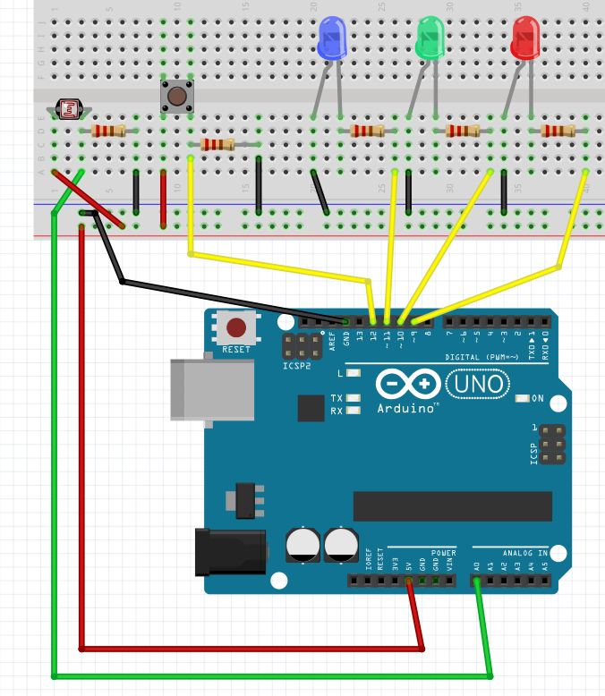

# Example 08 From "Getting Started with Arduino, Second Edition"

Updated and fixed ***Example 08A*** processing sketch from this book. 
I did ***not*** touch the arduino code as of yet. I may eventually fully 
test both pieces to ensure they work together, or update them otherwise.

## What is this exactly?

This project originally sets up a lamp that will change colors based on information pulled from an xml or RSS feed. 

This book version includes a light sensor and a button to start the process as well as the 3 LEDs for red, green, and blue.

This project and original code are over a decade old, and others have had the same issues I did. This led me to create this repository.

## Further
Another idea is to set up the code to work with the original schematic as well, using commented out alternative sections of code.

I hope this helps others out there who wanted to fully complete this project like I did.

---

# Schematics

I have located and included the original schematic for reference:

A well as the one from the book that goes with the above code:

I decided to make my own version of the book drawing which is here:

---

# Usage notes

You will need to create the font file in the  Processing IDE:

- copy the font name from the sketch
- under the "tools" menu click the font tool
- match a font to the right size and paste the name from the sketch
- click create

# Links

Here are links to the original sources of information:

- [Archive.org Getting Started Arduino Second Edition](https://dn790006.ca.archive.org/0/items/MassimoBanziGettingStartedWithArduinoMake2011/Massimo%20Banzi-Getting%20Started%20with%20Arduino%20-Make%20%282011%29.pdf)
- [Original blog post](https://todbot.com/blog/2006/10/23/diy-ambient-orb-with-arduino-update/)
